<div align="center">

# 🌍 Traveler

### A Full-Stack Social Platform for Travel Enthusiasts

[](./LICENSE)
[](https://nodejs.org)
[](https://react.dev)
[](https://mongodb.com)
[](https://socket.io)

**Traveler** is a MERN stack social network designed for explorers. Share travel posts, upload geo-tagged stories on an interactive map, log multi-step journey trees, and receive AI-powered destination recommendations — all in one platform.

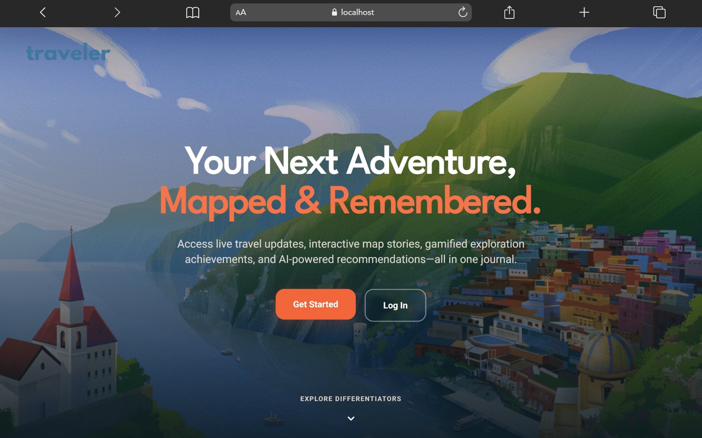

</div>

---

## 📖 Table of Contents

- [Why Traveler?](#-why-traveler)
- [Features](#-features)
- [Tech Stack](#-tech-stack)
- [Architecture Overview](#-architecture-overview)
- [Folder Structure](#-folder-structure)
- [Screenshots](#-screenshots)
- [Installation](#-installation)
- [Environment Variables](#-environment-variables)
- [Running the Application](#-running-the-application)
- [API Overview](#-api-overview)
- [Database Models](#-database-models)
- [Future Improvements](#-future-improvements)
- [License](#-license)
- [Author](#-author)

---

## 💡 Why Traveler?

Most social platforms treat travel as a secondary activity. Traveler was built from the ground up with the traveller's workflow in mind:

- **Geo-tagged stories** let you pin memories directly on an interactive world map.
- **Journey Trees** let you document multi-stop trips as a structured, shareable timeline.
- **An AI Recommendation Engine** serves personalised destination suggestions based on district and category filters.
- **Real-time notifications** via Socket.io keep you updated on likes, comments, and follows the moment they happen.
- **Achievement Badges** and reward systems encourage you to keep exploring and posting.

---

## ✨ Features

| Feature | Description |
|---------|-------------|
| 🔐 **Authentication** | JWT-based register/login, forgot password with email reset via Resend |
| 📸 **Travel Posts** | Create rich posts with multi-image upload, hashtags, location, star rating, and user tagging |
| 🗺️ **Story Map** | Upload geo-tagged 24-hour stories displayed as pins on an interactive Leaflet map |
| 🌲 **Journey Tree** | Log multi-step journeys with ordered stops; visualise the full trip as a node tree |
| 🤖 **Travel Advisor** | Query a built-in recommendation engine by province and category — returns destinations with map pins |
| 👥 **Social Feed** | Follow users, like and comment on posts, and get a personalised home feed |
| 🔔 **Real-time Alerts** | Socket.io-powered push notifications for social interactions |
| 🔍 **Search** | Search posts and users across the platform |
| 🏅 **Achievements** | Earn badges based on posting milestones via automated cron jobs |
| ☁️ **Cloud Media** | Cloudinary integration for optimised image and video hosting |
| 📱 **Responsive UI** | Mobile-first design with a bottom tab bar for small screens |
| 🌤️ **Weather Widget** | Live weather data on the home screen powered by OpenWeatherMap |
| 🔖 **Bookmarks** | Save travel posts, organize them into collections, and manage them under the Saved profile tab |
| 🤝 **Collab Journeys** | Invite friends to collaborate on active journeys with creator-attributed nodes |
| 📍 **Live Travel** | Ephemeral, in-memory Socket.io geolocation tracking with pulsing map overlays |

---

## 🛠 Tech Stack

### Frontend — `client/`

| Technology | Purpose |
|-----------|---------|
| React 18 + Vite | UI framework and build tool |
| Redux Toolkit | Global state management |
| React Router v6 | Client-side routing |
| Framer Motion | Page transitions and micro-animations |
| Leaflet / React-Leaflet | Interactive maps |
| Axios | HTTP client |
| Socket.io Client | Real-time event listening |
| React Hot Toast | Toast notification system |

### Backend — `server/`

| Technology | Purpose |
|-----------|---------|
| Node.js + Express | REST API server |
| MongoDB + Mongoose | Document database |
| Socket.io | Real-time bidirectional communication |
| JSON Web Token (JWT) | Stateless authentication |
| bcrypt | Password hashing |
| Cloudinary | Cloud media storage |
| Resend | Transactional email delivery |
| Morgan | HTTP request logging |
| node-cron | Scheduled jobs (badges, cleanup) |
| Multer | Multipart file parsing middleware |

### AI Recommendation Engine — `agent/`

| Technology | Purpose |
|-----------|---------|
| Node.js + Express | Lightweight microservice |
| CSV-based dataset | 69 tourist destinations across Pakistan |
| KNN / Euclidean Distance | Geo-proximity recommendation |
| Category + district filtering | Preference-based recommendations |

---

## 🏗 Architecture Overview

```
┌──────────────────────────────────────────────────────────┐
│                      CLIENT (React)                       │
│   Redux Store ─► Pages ─► Components ─► Axios / Socket  │
└───────────────────────┬──────────────────────────────────┘
                        │ HTTP + WebSocket
         ┌──────────────┴──────────────┐
         │                             │
┌────────▼─────────┐        ┌──────────▼──────────┐
│  Express Server  │        │   AI Agent (Node)   │
│  :5000           │        │   :5001             │
│ ───────────────  │        │ ─────────────────── │
│  /auth           │        │  GET /recommend     │
│  /post           │        │  GET /recommend/geo │
│  /story          │        │                     │
│  /user           │        │  CSV: 69 Pakistan   │
│  /journey        │        │  tourist sites      │
│  /collection     │        └─────────────────────┘
│  /message        │
│  /review         │
│  socket.io       │
└────────┬─────────┘
         │
┌────────▼─────────┐
│    MongoDB       │
│ ───────────────  │
│  users           │
│  posts           │
│  stories         │
│  journeys        │
│  notifications   │
│  collections     │
│  conversations   │
│  messages        │
│  reviews         │
└────────┬─────────┘
         │
┌────────▼─────────┐
│   Cloudinary     │
│  (media assets)  │
└──────────────────┘
```

---

## 📁 Folder Structure

```
traveler/
├── client/                          # React + Vite frontend
│   ├── docs/                        # Application screenshots
│   │   └── screenshots/
│   ├── src/
│   │   ├── Components/              # Reusable UI components
│   │   │   ├── Navbar.jsx
│   │   │   ├── Sidebar.jsx
│   │   │   ├── PostCard.jsx
│   │   │   ├── UploadStory.jsx
│   │   │   ├── JourneyCard.jsx
│   │   │   ├── Notification.jsx
│   │   │   └── ...
│   │   ├── Pages/                   # Route-level page components
│   │   │   ├── Landing.jsx
│   │   │   ├── Home.jsx
│   │   │   ├── Forum.jsx
│   │   │   ├── Story.jsx
│   │   │   ├── TravelAdvisor.jsx
│   │   │   ├── JourneyTreeView.jsx
│   │   │   ├── Profile.jsx
│   │   │   ├── CreatePost.jsx
│   │   │   └── Authentication/
│   │   │       ├── Login.jsx
│   │   │       ├── Signup.jsx
│   │   │       └── steps/
│   │   ├── Toolkit/                 # Redux Toolkit store
│   │   │   ├── store.js
│   │   │   └── slices/
│   │   │       ├── appConfigSlice.js
│   │   │       ├── feedSlice.js
│   │   │       ├── storySlice.js
│   │   │       ├── journeySlice.js
│   │   │       ├── userProfileSlice.js
│   │   │       ├── bookmarkSlice.js
│   │   │       └── liveSlice.js
│   │   ├── utils/
│   │   │   ├── axiosClient.js
│   │   │   └── motion.js
│   │   └── App.jsx
│   ├── .env.example
│   └── package.json
│
├── server/                          # Node.js + Express backend
│   ├── Controllers/
│   │   ├── authenticationController.js
│   │   ├── postController.js
│   │   ├── storyController.js
│   │   ├── userController.js
│   │   ├── journeyController.js
│   │   ├── bookmarkController.js
│   │   └── liveController.js
│   ├── Models/
│   │   ├── User.js
│   │   ├── post.js
│   │   ├── story.js
│   │   ├── journey.js
│   │   └── notification.js
│   ├── Routers/
│   │   ├── authenticationRouters.js
│   │   ├── postRouter.js
│   │   ├── storyRouter.js
│   │   ├── userRouter.js
│   │   ├── journeyRouter.js
│   │   └── liveRouter.js
│   ├── Middleware/
│   │   ├── jwtAuthMiddleware.js
│   │   └── uploads.js
│   ├── Utils/
│   │   ├── cloudinaryConfig.js
│   │   ├── responseWrapper.js
│   │   └── utils.js
│   ├── db.js
│   ├── socket.js
│   ├── index.js
│   ├── .env.example
│   └── package.json
│
├── agent/                           # AI Recommendation microservice
│   ├── Tourist Destinations.csv     # 69 destinations dataset
│   ├── server.js                    # Express API + KNN logic
│   ├── .env.example
│   └── package.json
│
├── .gitignore
├── LICENSE
├── CONTRIBUTING.md
└── README.md
```

---

## 📸 Screenshots

<table>
  <tr>
    <td align="center"><strong>Landing Page</strong></td>
    <td align="center"><strong>Login</strong></td>
  </tr>
  <tr>
    <td></td>
    <td>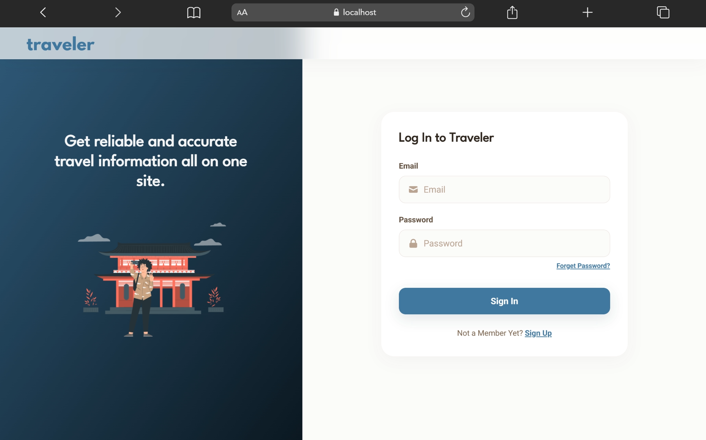</td>
  </tr>
  <tr>
    <td align="center"><strong>Signup</strong></td>
    <td align="center"><strong>Home Feed</strong></td>
  </tr>
  <tr>
    <td>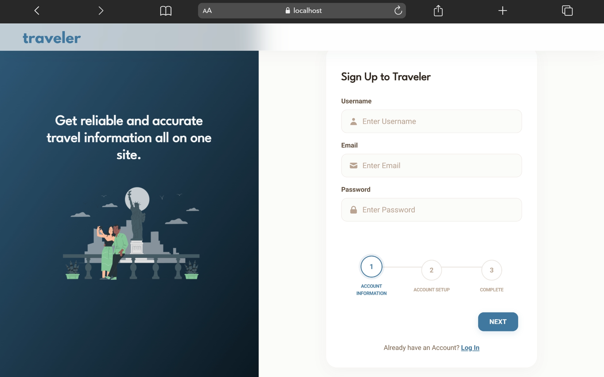</td>
    <td>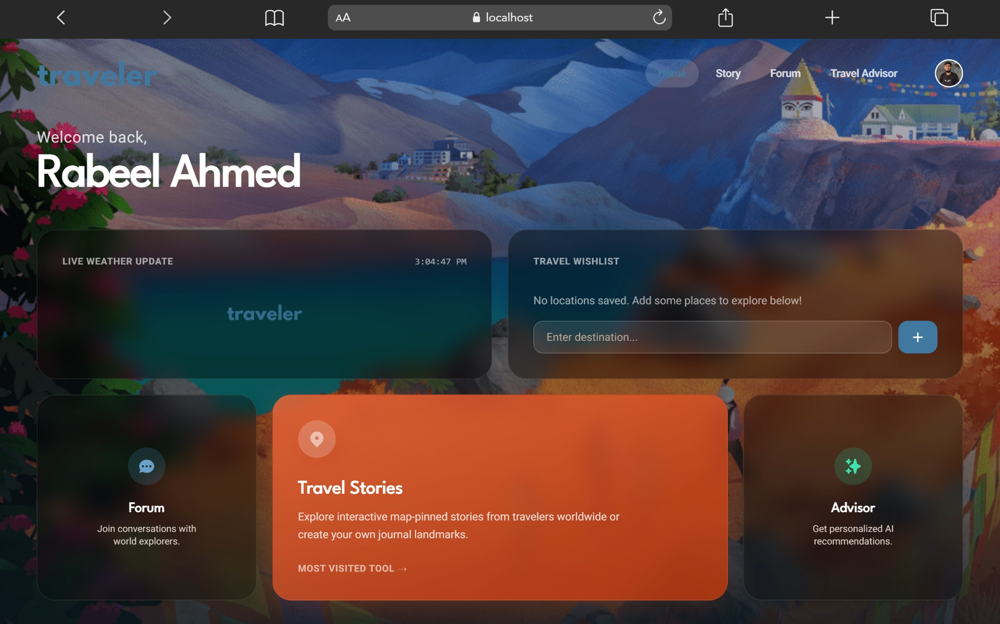</td>
  </tr>
  <tr>
    <td align="center"><strong>Travel Forum</strong></td>
    <td align="center"><strong>Story Map</strong></td>
  </tr>
  <tr>
    <td>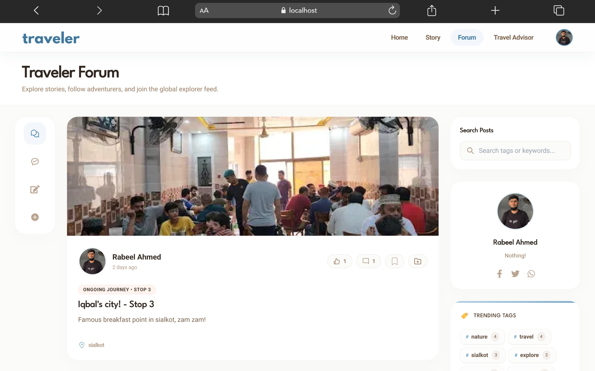</td>
    <td>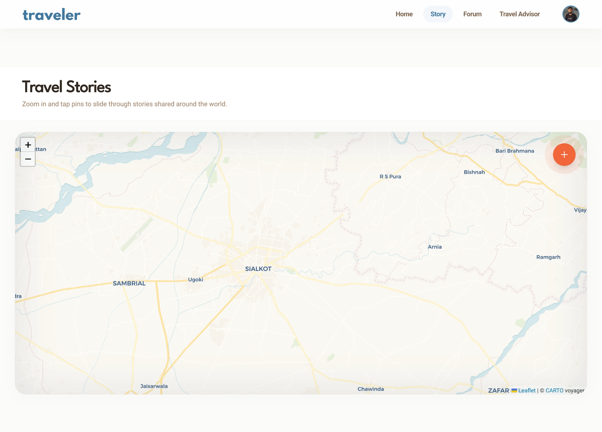</td>
  </tr>
  <tr>
    <td align="center"><strong>Travel Advisor</strong></td>
    <td align="center"><strong>Journey Tree</strong></td>
  </tr>
  <tr>
    <td>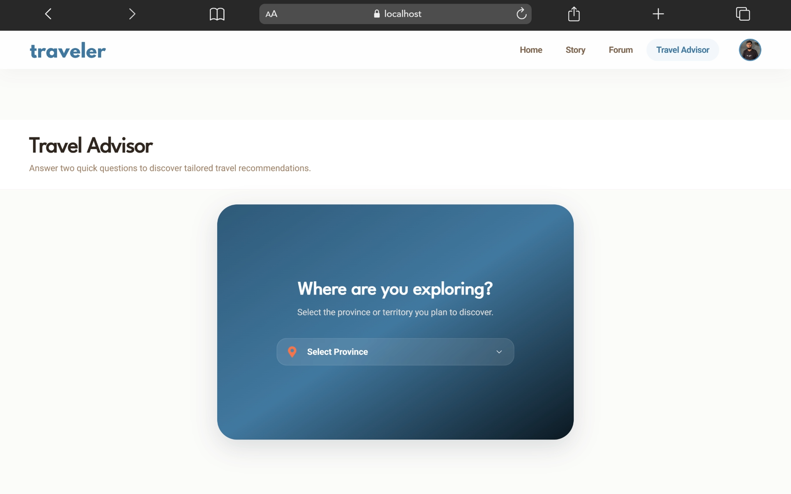</td>
    <td>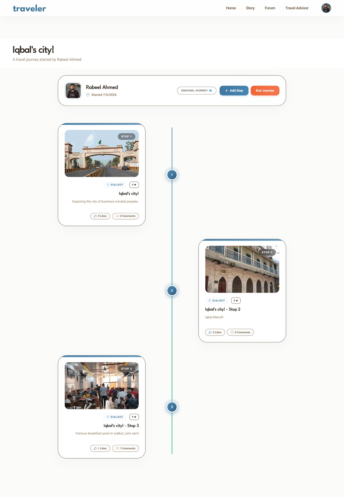</td>
  </tr>
  <tr>
    <td align="center"><strong>Profile & Collections</strong></td>
    <td align="center"><strong>Real-time Notifications</strong></td>
  </tr>
  <tr>
    <td>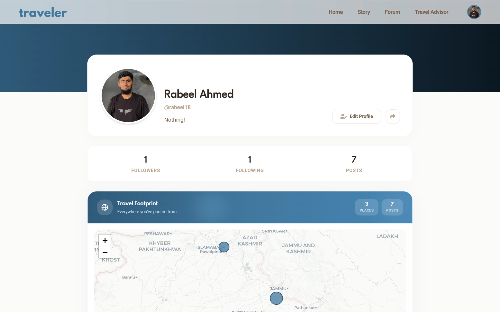</td>
    <td>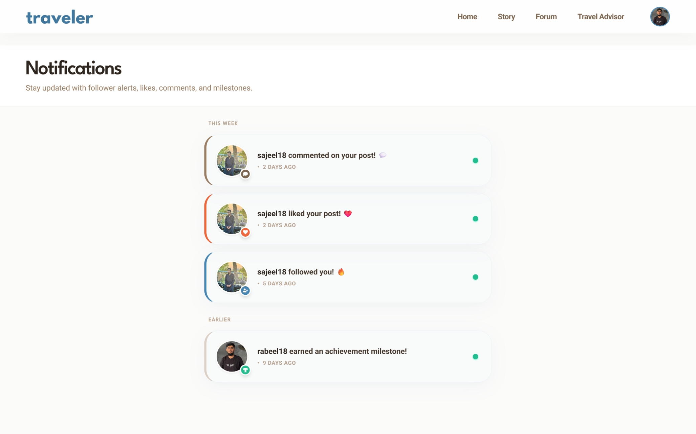</td>
  </tr>
  <tr>
    <td align="center"><strong>Direct Messaging</strong></td>
    <td align="center"><strong>-</strong></td>
  </tr>
  <tr>
    <td>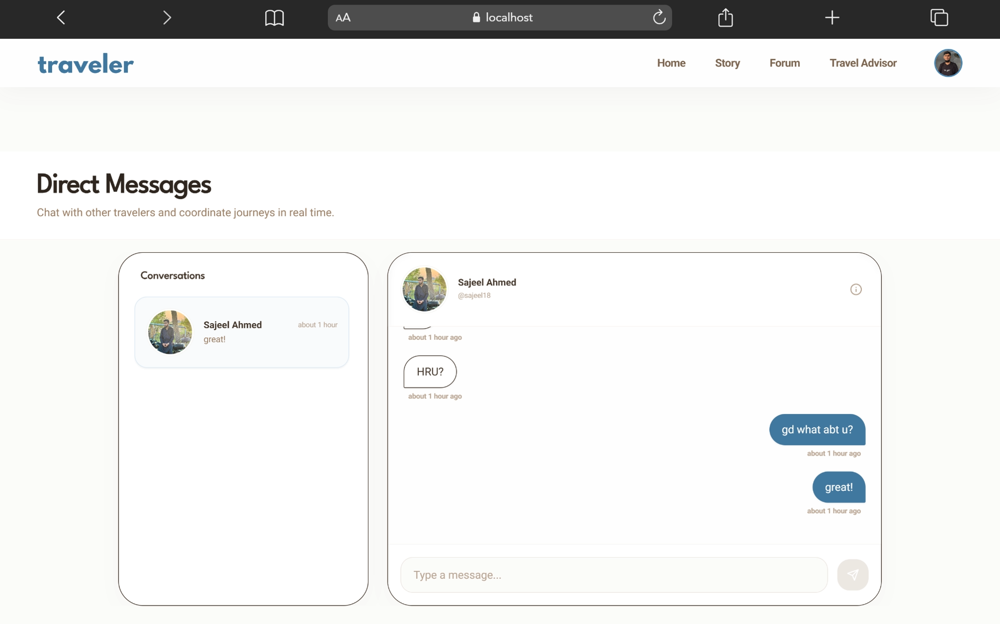</td>
    <td>-</td>
  </tr>
</table>

---

## 🚀 Installation

### Prerequisites

- [Node.js](https://nodejs.org/) v18 or higher
- [MongoDB](https://www.mongodb.com/) (local instance or Atlas URI)
- [Cloudinary](https://cloudinary.com/) account (for media uploads)
- [Resend](https://resend.com/) account (for email-based password reset)
- [OpenWeatherMap](https://openweathermap.org/) API key (for weather widget)

### Clone the Repository

```bash
git clone https://github.com/RabeelAhmed/Traveler.git
cd Traveler
```

### Install Dependencies

```bash
# Install client dependencies
npm install --prefix client

# Install server dependencies
npm install --prefix server

# Install AI agent dependencies
npm install --prefix agent
```

---

## 🔐 Environment Variables

Copy the example files and fill in your credentials:

```bash
cp server/.env.example server/.env
cp client/.env.example client/.env
cp agent/.env.example agent/.env
```

### `server/.env`

| Variable | Description |
|----------|-------------|
| `PORT` | Port the Express server listens on (default: `5000`) |
| `ORIGIN` | Frontend URL for CORS (e.g. `http://localhost:5173`) |
| `MONGO_URI` | MongoDB connection string |
| `JWT_SECRET` | Secret key for signing JWT tokens |
| `CLOUDINARY_CLOUD_NAME` | Your Cloudinary cloud name |
| `CLOUDINARY_API_KEY` | Cloudinary API key |
| `CLOUDINARY_API_SECRET` | Cloudinary API secret |
| `RESEND_API_KEY` | Resend API key for transactional emails |

### `client/.env`

| Variable | Description |
|----------|-------------|
| `VITE_SERVER_BASE_URL` | Express backend URL (e.g. `http://localhost:5000`) |
| `VITE_TRAVEL_ADVISOR_BASE_URL` | AI agent URL (e.g. `http://localhost:5001`) |
| `VITE_WEATHER_API_KEY` | OpenWeatherMap API key |
| `VITE_CLOUDINARY_CLOUD_NAME` | Your Cloudinary cloud name |

### `agent/.env`

| Variable | Description |
|----------|-------------|
| `PORT` | Port for the AI microservice (default: `5001`) |

---

## ▶️ Running the Application

Start all three services in separate terminal windows:

**1. Backend Server**

```bash
cd server
node index.js
# → Listening on http://localhost:5000
```

**2. AI Recommendation Engine**

```bash
cd agent
node server.js
# → Listening on http://localhost:5001
```

**3. React Client**

```bash
cd client
npm run dev
# → Listening on http://localhost:5173
```

Open `http://localhost:5173` in your browser.

---

## 📡 API Overview

Protected routes require a JWT token in the `Authorization: Bearer <token>` header.

### Auth — `/auth`

| Method | Endpoint | Auth | Description |
|--------|----------|:----:|-------------|
| `POST` | `/auth/signup` | ❌ | Register a new user |
| `POST` | `/auth/login` | ❌ | Authenticate and receive JWT |
| `GET` | `/auth/profile` | ✅ | Get logged-in user's profile and posts |
| `POST` | `/auth/updateprofile` | ✅ | Update profile details and picture |
| `POST` | `/auth/forget-pasword` | ❌ | Send password reset email |
| `POST` | `/auth/reset-password` | ❌ | Reset password via token |
| `GET` | `/auth/signature` | ❌ | Get Cloudinary upload signature |

### Posts — `/post`

| Method | Endpoint | Auth | Description |
|--------|----------|:----:|-------------|
| `POST` | `/post/createpost` | ✅ | Create a new travel post |
| `GET` | `/post/:_id` | Optional | Get a single post by ID |
| `POST` | `/post/likepost` | ✅ | Toggle like on a post |
| `POST` | `/post/addcomment` | ✅ | Add a comment to a post |
| `POST` | `/post/deletecomment` | ✅ | Delete a comment |
| `POST` | `/post/deletepost` | ✅ | Delete a post |
| `GET` | `/post/search` | ✅ | Search posts and users |
| `GET` | `/post/signature` | ✅ | Get Cloudinary multi-upload signature |

### Stories — `/story`

| Method | Endpoint | Auth | Description |
|--------|----------|:----:|-------------|
| `POST` | `/story/addstory` | ✅ | Upload a geo-tagged story |
| `GET` | `/story/getstory` | ✅ | Fetch all active stories (expires in 24h) |
| `POST` | `/story/like` | ✅ | Toggle like on a story |
| `GET` | `/story/generate-signature` | ❌ | Get Cloudinary story upload signature |

### Users — `/user`

| Method | Endpoint | Auth | Description |
|--------|----------|:----:|-------------|
| `POST` | `/user/follow` | ✅ | Follow or unfollow a user |
| `GET` | `/user/feed` | ✅ | Get personalised feed from followed users |
| `GET` | `/user/getuserprofile/:_id` | ✅ | Get a user's public profile |
| `GET` | `/user/getnotification` | ✅ | Retrieve social notifications |

### Journeys — `/journey`

| Method | Endpoint | Auth | Description |
|--------|----------|:----:|-------------|
| `POST` | `/journey/start` | ✅ | Initialise a new journey |
| `POST` | `/journey/:id/addstep` | ✅ | Add a travel stop to a journey (or collab) |
| `POST` | `/journey/:id/end` | ✅ | Mark a journey as complete (owner only) |
| `GET` | `/journey/collaborating` | ✅ | Get journeys current user is collaborating on |
| `POST` | `/journey/:id/invite` | ✅ | Invite a user to collaborate |
| `POST` | `/journey/:id/invite/respond` | ✅ | Accept/decline a collaboration invite |
| `DELETE` | `/journey/:id/collaborator/:userId` | ✅ | Remove a collaborator |
| `GET` | `/journey/:id` | Optional | Retrieve a journey with its step tree |

### Bookmarks — `/bookmark`

| Method | Endpoint | Auth | Description |
|--------|----------|:----:|-------------|
| `GET` | `/bookmark` | ✅ | Get all posts saved by current user |
| `POST` | `/bookmark/toggle/:postId` | ✅ | Toggle saved status of a post |

### Live Presence — `/live`

| Method | Endpoint | Auth | Description |
|--------|----------|:----:|-------------|
| `GET` | `/live/users` | ✅ | Retrieve all active live travel users |

### Collections — `/collection`

| Method | Endpoint | Auth | Description |
|--------|----------|:----:|-------------|
| `GET` | `/collection` | ✅ | Get all collections owned by current user |
| `POST` | `/collection` | ✅ | Create a new collection |
| `GET` | `/collection/:id` | ✅ | Get a collection details by ID |
| `PUT` | `/collection/:id` | ✅ | Update collection details (name, description, isPublic) |
| `DELETE` | `/collection/:id` | ✅ | Delete a collection |
| `POST` | `/collection/toggle-post` | ✅ | Toggle (add/remove) a post in a collection |

### Direct Messages — `/message`

| Method | Endpoint | Auth | Description |
|--------|----------|:----:|-------------|
| `POST` | `/message/conversation` | ✅ | Get or create a 1-to-1 conversation with another user |
| `GET` | `/message/conversations` | ✅ | Get all conversations for current user |
| `GET` | `/message/:conversationId` | ✅ | Get messages within a conversation (paginated) |
| `POST` | `/message/:conversationId` | ✅ | Send a new message |

### Destination Reviews — `/review`

| Method | Endpoint | Auth | Description |
|--------|----------|:----:|-------------|
| `POST` | `/review` | ✅ | Create or update a review for a location (upsert) |
| `GET` | `/review/location` | ✅ | Get all reviews & aggregation summary for a location |
| `GET` | `/review/mine` | ✅ | Get the current user's review for a location |
| `DELETE` | `/review/:id` | ✅ | Delete a review (author only) |
| `POST` | `/review/:id/helpful` | ✅ | Toggle helpful status on a review |

### AI Agent — `http://localhost:5001`

| Method | Endpoint | Auth | Description |
|--------|----------|:----:|-------------|
| `GET` | `/recommend` | ❌ | Recommend by `?district=` and/or `?category=` |
| `GET` | `/recommend/geo` | ❌ | Nearest destination to `?lat=&lon=` |

---

## 🗄 Database Models

### User
```
username, fullname, email, password (bcrypt), profilePicture { url, publicId },
bio, koFiUrl, dateOfBirth, posts[], stories[], followers[], following[],
savedPosts[] (ref: Post), badges[{ name, awardedAt }], verified, resetPasswordToken, resetPasswordExpires
```

### Post
```
userId (ref: User), title, description, location, hashtags[], postingDate,
rating (1–5), media[{ url, publicId }], tags[], likes[], journeyId (ref: Journey),
stepIndex, comments[{ userId, commentText, commentedAt }]
```

### Story
```
userId (ref: User), mediaUrl, publicId, location { type: Point, coordinates[] },
likes[], createdAt (TTL index — expires after 24 hours)
```

### Journey
```
userId (ref: User), title, description, steps[{ postId, stepIndex, addedAt, addedBy (ref: User) }],
startDate, endDate, isCompleted, collaborators[] (ref: User), pendingInvites[] (ref: User),
maxCollaborators, createdAt
```

### Notification
```
userId (ref: User), type (like | comment | follow | Achievement | Achivement | journey_start | journey_step | journey_complete | story_like | journey_invite | journey_invite_accepted),
fromUser (ref: User), postId (ref: Post), journeyId (ref: Journey), inviteStatus (pending | accepted | declined), isRead, createdAt
```

### Collection
```
owner (ref: User), name, description, posts[] (ref: Post), isPublic, createdAt
```

### Conversation
```
participants[] (ref: User), lastMessage (ref: Message), updatedAt
```

### Message
```
conversationId (ref: Conversation), sender (ref: User), text, isRead, createdAt
```

### Review
```
author (ref: User), location, rating (1-5), title, body, visitedAt, helpful[] (ref: User), createdAt
```

---

## 🔮 Future Improvements

- [ ] **AI Model Upgrade** — Replace CSV filtering with a trained ML model (cosine similarity / collaborative filtering)
- [x] **Direct Messaging** — Private real-time chat via Socket.io
- [ ] **Progressive Web App** — Service worker and manifest for offline support
- [x] **Post Bookmarks / Collections** — Save posts to custom curated albums/collections
- [ ] **Multi-language Support** — i18n with React Intl
- [ ] **Analytics Dashboard** — Post reach, engagement rates, and follower growth charts
- [ ] **Email Verification** — Verify email address after registration

---

## 📄 License

This project is licensed under the **MIT License** — see the [LICENSE](./LICENSE) file for details.

---

## 👤 Author

**Rabeel Ahmed**

- GitHub: [@RabeelAhmed](https://github.com/RabeelAhmed)
- Email: rabeelsulehria3@gmail.com

---

<div align="center">

⭐ If you found this project useful, please consider giving it a star!

</div>